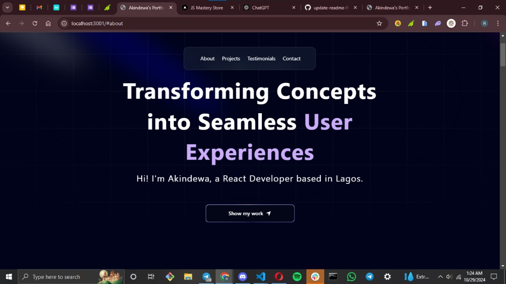
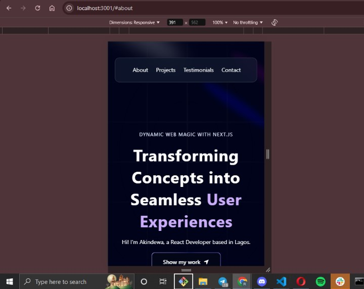

# Portfolio
  
## Overwiew
        This portfolio project serves as a small collection of my work and projects, each representing steps in my learning and development as a developer. 

   ### Feature:
  - About Me Section: 
       - Provides a brief overview introducing who I am, my background, and my professional goals
       
       
  - Project Showcase:

       -  Project cards or sections give each project its own space with a title, description, technologies used, and a link to a live version or demo.

  - Skills & Technologies:
       -  Displays my core skills and tools in a list or visual format, allowing viewers to quickly understand my expertise.

  -  Contact Information: 
       - Includes an easily accessible way to reach out, like an email address or contact form.

  - Responsive Design:
       -  Ensures the portfolio works seamlessly across different screen sizes, from mobile devices to desktops.

  -   Testimonials or Recommendations: 
       - Features a few brief quotes from clients, mentors, or colleagues to add credibility.

### Screenshot (desktop and mobile view)

  -    

  -    

### Links

   -   [Live Demo](https://website-git-main-akindewas-projects.vercel.app/)

   -     [Source Code](https://github.com/Akindewa/portfolio.git)

### Built with
  - TypeScript
  - Next.js
  - JavaScript
  - CSS
